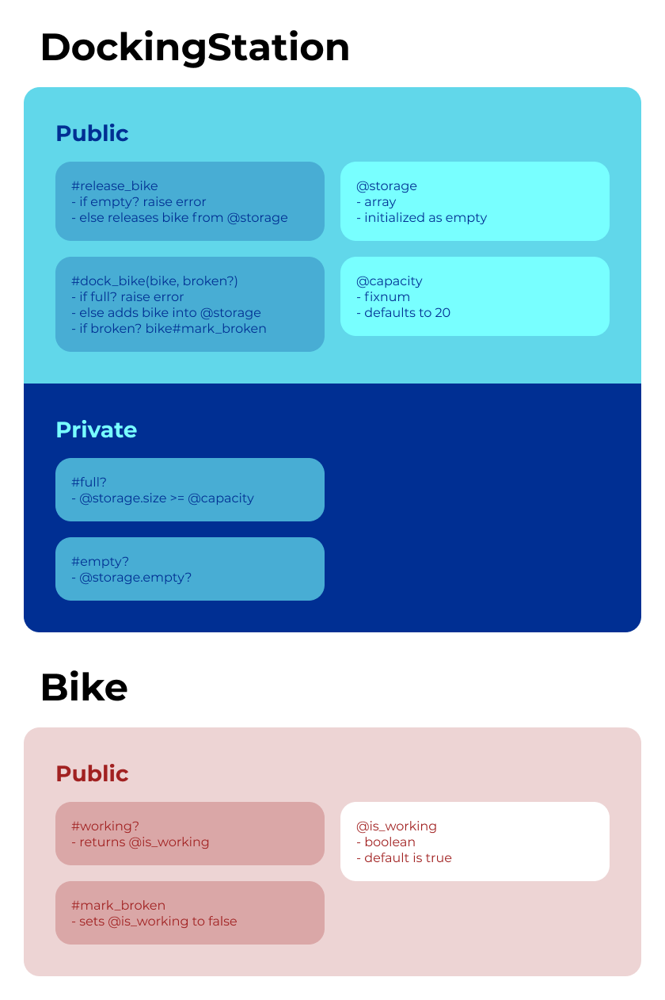

# Boris Bikes

This is a project to emulate a Santander Cycle system in Ruby.

## This project will help us to reach the following learning objectives
- Being able to TDD anything
- Programming fluently
- Ability to debug anything

## User stories

User stories are brief descriptions of a feature told from the perspective of a person who desires that capability

> As a person,  
>  So that I can use a bike,  
> I'd like a docking station to release a bike.

> As a person,  
> So that I can use a good bike,  
> I'd like to see if a bike is working

> As a member of the public  
> So I can return bikes I've hired  
> I want to dock my bike at the docking station

> As a member of the public  
> So I can decide whether to use the docking station  
> I want to see a bike that has been docked

> As a maintainer of the system,  
> So that I can control the distribution of bikes,  
> I'd like docking stations not to accept more bikes than their capacity.

> As a system maintainer,  
> So that I can plan the distribution of bikes,  
> I want a docking station to have a default capacity of 20 bikes.

> As a system maintainer,
> So that busy areas can be served more effectively,
> I want to be able to specify a larger capacity when necessary.

> As a member of the public,
> So that I reduce the chance of getting a broken bike in future,
> I'd like to report a bike as broken when I return it.

> As a maintainer of the system,
> So that I can manage broken bikes and not disappoint users,
> I'd like docking stations not to release broken bikes.

> As a maintainer of the system,
> So that I can manage broken bikes and not disappoint users,
> I'd like docking stations to accept returning bikes (broken or not).

## Domain Model

Objects | Messages
---------|----------
 Person | 
 Member of Public | 
 System Maintainer | 
 DockingStation | release_bike   dock_bike(bike, broken)   @storage (array of stored bikes)  
 Bike | working?   mark_broken

### Diagram:

 